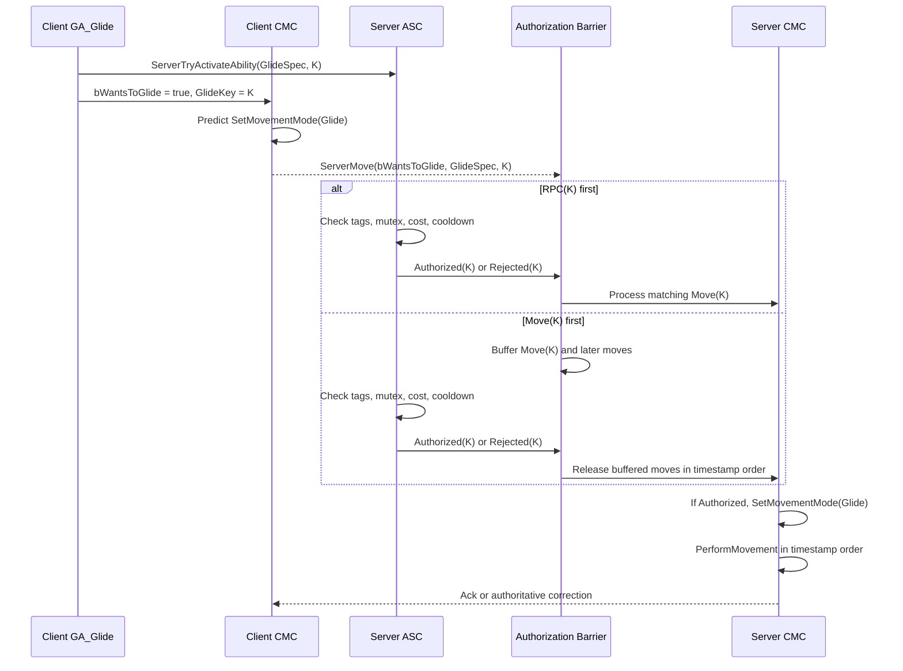

# Glide 的 GAS + CMC 网络架构方案

## 1. 背景

当前角色基于 Unreal Engine Gameplay Ability System（GAS）和 Character Movement Component（CMC）实现自定义滑翔移动模式 `Glide`。

最初设计中，`GA_Glide` 使用 `LocalPredicted`：客户端预测激活技能，`ActivateAbility` 直接切换 CMC 到 Glide；离开 Glide MovementMode 时自动取消技能。该设计同时依赖两条客户端到服务器的网络通道：

- GAS 使用 Reliable `ServerTryActivateAbility` RPC 同步技能激活。
- CMC 使用 Unreliable `ServerMovePacked` 发送移动输入、时间戳和客户端预测结果。

两条通道没有可依赖的跨通道执行顺序。在弱网、抖动、丢包重传或 ASC 与 Character 位于不同 ActorChannel 时，服务器可能先处理任意一条消息，从而产生技能状态和移动模式的时序竞争。

## 2. 需求总结

### 2.1 功能需求

1. 玩家按下滑翔输入后，客户端必须当帧响应，不等待网络往返。
2. DS 必须保持对技能授权、互斥、消耗、冷却和移动结果的最终权威。
3. `GA_Glide` 保持 `LocalPredicted`，服务器激活继续通过标准 Reliable `ServerTryActivateAbility` RPC 完成。
4. `GA_Glide` 必须继续参与 GAS 的 Block/Cancel Tags、GameplayEffect、GameplayCue 和其他技能互斥。
5. Glide 的开始、持续和退出必须支持 CMC SavedMove、服务器重模拟、客户端纠正和未确认 Move 重放。
6. 移动包丢失后，后续移动包必须能够恢复 Glide 请求，不能依赖只发送一次的脉冲事件。

### 2.2 网络质量目标

核心目标是消除以下额外拉扯：

> 合法的 Glide 请求仅因 GAS 激活 RPC 和 CMC ServerMove 到达顺序不同，导致服务器使用错误 MovementMode 模拟并纠正客户端。

“弱网无拉扯”不能定义为绝对零 CMC Correction。以下情况仍然可能产生合理纠正：

- 服务器拒绝技能授权、消耗或互斥检查。
- 客户端与服务器对动态碰撞、移动平台或外部状态的判断不同。
- 长时间连续丢包导致服务器模拟时间被裁剪。
- 其他权威技能、控制效果或环境事件改变了移动状态。

## 3. Unreal Engine 网络事实

### 3.1 ServerMove 不是同步客户端 MovementMode

`ServerMove` 传输的是客户端输入历史和预测结果。DS 会使用输入重新执行 `MoveAutonomous` / `PerformMovement`，再比较服务器结果与客户端上报结果。

客户端上报的 `MovementMode` 是预测结果，用于误差检测，不是要求服务器执行 `SetMovementMode` 的命令。默认情况下，如果 DS 最终 MovementMode 与客户端不一致，CMC 会将其视为重大误差并向 owning client 发送服务器权威模式、位置和速度；客户端随后回滚并重放未确认 SavedMove。

### 3.2 Reliable RPC 与 Unreliable Move 没有硬顺序保证

客户端先调用 `ServerTryActivateAbility`，只能保证本机提交顺序，不能保证 DS 执行顺序：

- GAS 激活 RPC 是 Reliable。
- `ServerMovePacked` 是 Unreliable。
- 不同 ActorChannel 之间没有顺序保证。
- 即使位于同一 Channel，Reliable bunch 的可靠序号等待也不能作为后续 Unreliable bunch 的因果屏障。

因此，调整本地调用顺序、提前发送旧 Move 或将首个 Glide Move 延后一帧，都只能降低乱序概率，不能成为正确性依据。

### 3.3 本文中的 K

本文使用 `K` 表示本次 LocalPredicted 能力激活的 `FPredictionKey`：

```text
K = ActivationInfo.GetActivationPredictionKey()
```

客户端 ASC 在预测激活时生成 `K`，并自动通过 `ServerTryActivateAbility` RPC 发送给服务器。为了关联对应的 Glide Move，客户端 CMC 还需要把 `K`（必要时连同 `FGameplayAbilitySpecHandle`）写入自定义 SavedMove/MoveData。

`K` 的作用仅是关联同一次技能激活和移动请求：

```text
ServerTryActivateAbility(GlideSpecHandle, K)
ServerMove(bWantsToGlide, GlideSpecHandle, K)
```

`K` 不是额外的网络消息序号，也不能保证 RPC 与 Move 的到达顺序。服务器应使用 `(AbilitySpecHandle, K)` 作为短生命周期关联键，避免仅使用 PredictionKey 数值产生歧义。

## 4. 被否决的方案

### 4.1 LocalPredicted GA 直接切 MovementMode

```text
ServerTryActivateAbility RPC -> GA ActivateAbility -> SetMovementMode(Glide)
```

问题：服务器可能在处理激活前的旧 Falling Move 之前进入 Glide，导致旧 Move 被 Glide 物理重演；反向顺序下，服务器又可能在 GA 尚未激活时拒绝已预测为 Glide 的 Move。

结论：存在双通道竞态，不满足目标。

### 4.2 只记录 Pending，但不缓存 Move

问题：Glide Move 先到时，如果 DS 只记录请求却继续按 Falling 模拟，客户端已经按 Glide 预测的位移仍会与服务器分叉。之后即使 GA RPC 成功，服务器也无法使用 Stock CMC 回滚世界并重新模拟已经消费的 Move。

结论：仅增加 `PendingMovement` 状态不足以消除合法请求拉扯；要保持正确时间轴，未知授权状态的 Move 必须等待授权结果，或者接受纠正。

### 4.3 直接相信 MoveData.MovementMode

问题：客户端可以直接决定服务器物理状态，绕过技能互斥、冷却、消耗和安全校验。

结论：不可接受。

### 4.4 将所有 ServerMove 改为 Reliable

问题：任何丢包都会阻塞后续移动，产生队头阻塞；这违背 CMC 使用 Unreliable Move 保持实时性的设计。

结论：不可接受。

## 5. 最终推荐方案

### 5.1 核心决策

保留两条 UE 标准网络通道，但使用 `(AbilitySpecHandle, PredictionKey K)` 建立显式因果关系：

```text
GAS Reliable RPC：决定 GA_Glide 是否被服务器授权和激活
CMC Unreliable Move：决定物理 Glide 应从哪个客户端移动时间点开始
```

正确性规则是：

```text
只有 Authorized(K) 和 Move(K) 同时具备，服务器才能从该 Move 开始进入 Glide。
```

服务器 `GA_Glide::ActivateAbility` 不直接调用 `SetMovementMode`，而是进入 `PendingMovement` 并登记 `Authorized(K)`。实际 MovementMode 仍由 CMC 在处理对应 Move 时修改。

如果 Move(K) 先到，服务器不能提前信任客户端，也不能继续消费该 Move 后再期望无损补救。为了消除合法请求因乱序产生的拉扯，需要建立有界授权屏障：暂存该 Move 及其后的移动数据，等待 GAS RPC 对 K 的接受或拒绝结果。

### 5.2 职责划分

| 模块 | 职责 |
| --- | --- |
| 客户端 GA_Glide | LocalPredicted 激活，产生 K，设置 `bWantsToGlide`，立即启动本地预测表现 |
| 客户端 CMC | 当帧预测进入/退出 Glide，将 `bWantsToGlide` 与 K 写入 SavedMove |
| 服务器 ASC/GA_Glide | 通过标准 RPC 完成 CanActivate、互斥、激活和授权，登记 `Authorized(K)` 或 `Rejected(K)` |
| 授权协调器 | 关联 RPC(K) 与 Move(K)，管理 Pending/Accepted/Rejected、缓存上限和超时 |
| 服务器 CMC | 在 K 已授权后，从对应 Move 开始切换 MovementMode 并执行 PhysGlide |
| 客户端表现层 | 根据预测 MovementMode/本地 GA 驱动动画、镜头、音效和可回滚表现 |

### 5.3 启动时序



时序图中的 GA 激活始终来自 `ServerTryActivateAbility` RPC。Move 只向协调器提供 K 和物理起始时间，不负责激活服务器 GA。

### 5.4 两种到达顺序

#### RPC(K) 先到

服务器 ASC 正常激活 `GA_Glide`，应用技能互斥和阻挡 Tag，并登记 `Authorized(K)`。GA 进入 `PendingMovement`，但不切 MovementMode。

- 激活前的旧 Falling Move 到达时，服务器仍按 Falling 处理，不会被提前切换的 Glide 污染。
- 对应 Move(K) 到达时，协调器发现 K 已授权，CMC 从该 Move 开始进入 Glide。
- 进入成功后，GA 从 `PendingMovement` 转为 `Gliding`。

#### Move(K) 先到

协调器发现 K 尚无 GAS 结果时，将该 Move 以及后续 Move 暂存，不推进这个角色的服务器移动时间轴。

- RPC 接受：从 Move(K) 开始按 Glide 依次处理缓存 Move。
- RPC 拒绝：按非 Glide 状态处理或丢弃缓存并发送权威纠正。
- 等待超时：按拒绝处理，避免 Reliable RPC 丢包重传导致无限缓存和服务器移动永久停滞。

仅缓存首个 Move 而继续处理后续 Move 是错误的，因为后续时间轴已经依赖客户端 Glide 预测；必须从第一个未知授权 Move 起建立连续屏障。

### 5.5 GA 状态机

```text
Inactive
-> PendingMovement：RPC 已授权，等待或正在释放对应 Move
-> Gliding：服务器 CMC 已从 Move(K) 进入 Glide
-> Ending
```

在 `PendingMovement` 阶段，GA 已经 Active，Block/Cancel Tags 可以立即参与其他 GAS RPC 的互斥；但 `MovementMode != Glide` 不能作为自动取消条件。只有授权拒绝、输入取消、等待超时或明确的权威终止条件可以结束 Pending GA。

### 5.6 持续与退出时序

`bWantsToGlide` 必须作为持续状态写入后续 SavedMove，而不是单次事件。

退出来源包括：

- 客户端松开输入，Move 中持续发送 `bWantsToGlide = false`。
- CMC 检测到落地、碰撞或其他物理退出条件。
- 服务器 GA 因体力耗尽、互斥技能或控制效果被取消。

进入 `Gliding` 后，退出时由 CMC 修改 MovementMode；服务器随后结束 `GA_Glide` 并清理持续 GE、Tag 和 Cue。如果 GA 被其他能力先行取消，GA 的结束回调只向 CMC 发出“退出 Glide”的请求，最终模式仍由 CMC 修改。

## 6. 实现设计

### 6.1 自定义 SavedMove

SavedMove 至少需要保存：

```text
bWantsToGlide
GlideAbilitySpecHandle
GlidePredictionKey K
```

需要覆盖或扩展以下环节：

- `Clear`：重置 Glide 请求状态。
- `SetMoveFor`：从 CMC 捕获请求状态、AbilitySpecHandle 和 K。
- `GetCompressedFlags`：有空闲自定义位时编码 `bWantsToGlide`。
- `CanCombineWith`：Glide 状态、AbilitySpecHandle 或 K 改变时禁止合并。
- `PrepMoveFor`：客户端 Correction 后重放时恢复请求。
- `IsImportantMove`：确保 Glide 边沿 Move 在需要时被视为重要 Move。

如果压缩标志位不足，应扩展 `FCharacterNetworkMoveData` 及其 `Serialize`，不要复用含义不兼容的已有标志位。

### 6.2 GAS 授权结果登记

服务器 ASC 仍通过标准 `ServerTryActivateAbility` 处理 `GA_Glide`。协调器不替代 ASC 的激活逻辑，只监听并登记结果：

```text
Pending[(SpecHandle, K)]
Authorized[(SpecHandle, K)]
Rejected[(SpecHandle, K)]
```

当 RPC 激活成功时：

- 服务器 GA 进入 `PendingMovement`。
- GAS 的 Block/Cancel Tags 立即生效，保持与其他 GA RPC 的互斥顺序。
- 协调器登记 `Authorized(K)` 并尝试释放对应缓存 Move。

当 RPC 激活失败时：

- 协调器登记 `Rejected(K)`。
- 对应缓存 Move 不得进入 Glide。
- 客户端依靠 GAS PredictionKey 拒绝和 CMC 权威纠正回滚。

### 6.3 有界 Move 缓存

缓存入口位于 Move 已完成反序列化、尚未推进服务器移动时间轴的位置。需要缓存从第一个未知 K 的 Move 开始的连续移动数据，并保持客户端时间戳顺序。

缓存必须具备以下边界：

- 最大 Move 数量。
- 最大总字节数。
- 最大等待时长。
- 每连接/每角色独立限额。
- Actor 销毁、断线、能力清除和时间戳重置时立即清理。

释放时必须重新执行正式的时间戳、重复 Move 和合法性检查。不能因为 Move 曾被缓存就跳过 `VerifyClientTimeStamp` 等服务器校验。

如果 K 已授权，服务器在处理匹配 Move 时执行：

```cpp
if (CanPhysicallyEnterGlide() && IsAuthorizedGlideAbilityActive(SpecHandle, K))
{
    SetMovementMode(MOVE_Custom, CMOVE_Glide);
}

MoveAutonomous(...);
```

GA 激活或 Commit 最终失败时，CMC 不得进入 Glide。缓存释放、超时和拒绝路径都必须幂等，避免同一个 Move 被处理两次。

### 6.4 客户端预测与表现

`GA_Glide` 保持 LocalPredicted。客户端激活后生成 K、设置 `bWantsToGlide`，CMC 当帧预测进入 Glide，因此操作手感不依赖服务器往返。

优先使用本地预测 GA 和预测 MovementMode 驱动：

- Glide 动画状态。
- 镜头和 FOV。
- 本地音效和非权威特效。
- 本地技能输入阻挡状态。

客户端 GA 激活被服务器拒绝时，GAS 使用 K 回滚预测副作用；CMC 使用服务器 Correction 回滚 MovementMode 和位置。两条回滚路径必须共享同一请求状态，避免 GAS 已拒绝但 CMC 仍持续发送旧 K 的 Glide 请求。

### 6.5 与其他 RPC 技能的互斥

`GA_Glide` 和其他技能都通过同一服务器 ASC 的 Reliable RPC 激活，因此 GAS 内部的激活顺序和互斥语义保持不变：

- 其他 GA RPC 在 Glide RPC 前被处理：其他 GA 获得 Tag，Glide RPC 被拒绝，缓存 Move 按非 Glide 结果处理。
- Glide RPC 先被处理：GA_Glide 进入 PendingMovement 并建立阻挡 Tag，后到的其他 GA RPC 被拒绝或按配置取消 Glide。

Glide Move 的先后不会抢占 GAS 互斥权，因为 Move 不能激活 GA。对于同一 ASC 上的 Reliable 激活 RPC，服务器按 GAS RPC 顺序决定互斥结果。

## 7. 潜在问题与应对措施

| 潜在问题 | 影响 | 应对措施 |
| --- | --- | --- |
| RPC 先到但对应 Move 丢失 | GA 长时间停留在 PendingMovement，阻挡其他技能 | Pending 超时；明确结束/退款策略；收到取消 RPC 或角色状态失效时立即清理 |
| Move 先到且 RPC 正在重传 | 服务器移动时间轴停顿，缓存增长 | 限制 Move 数、字节数和等待时间；超时按拒绝处理并纠正 |
| 缓存期间继续收到 Move | 必须保持连续时间轴，不能只缓存首包 | 从首个未知 K 起缓存全部后续 Move，直到屏障解除 |
| MoveData 容器被下一包复用 | 缓存引用失效或数据被覆盖 | 对需要等待的数据做安全深拷贝，或缓存可独立反序列化的原始 payload |
| 缓存释放后时间戳非法 | 重复处理、时间加速或状态错乱 | 释放时重新执行正式时间戳和重复 Move 校验，失败则丢弃并纠正 |
| SavedMove 合并跨过 Glide 边沿 | DS 无法定位准确的物理起始时间 | `bWantsToGlide`、SpecHandle 或 K 不同时禁止合并，并标记边沿 Move 为重要 |
| K 数值复用或跨能力冲突 | RPC 与错误 Move 被关联 | 使用 `(ASC/连接, AbilitySpecHandle, K)` 复合键，并设置短生命周期和清理点 |
| 服务器拒绝 GA | 客户端预测 Glide 后被纠正 | GAS 使用 K 回滚技能副作用，CMC 回滚移动；清除客户端后续 Move 中的旧 K |
| Pending 阶段检查 `MovementMode != Glide` | RPC 先到时 GA 被错误自动取消 | 只有进入过 Gliding 后，退出 MovementMode 才结束 GA；Pending 使用独立超时/取消条件 |
| Commit 时机不一致 | 已扣费但 Move 永不到达，或进入 Glide 后扣费失败 | 明确“RPC 接受即扣费”或“匹配 Move 到达再 Commit”；后一种需验证 PredictionKey 下 GE 对账 |
| GA 被其他技能取消 | 缓存 Move 仍试图进入 Glide | 将 K 标记 Rejected/Cancelled，释放缓存时禁止 Glide 并发送权威纠正 |
| 客户端伪造 K 或 Glide Move | 利用缓存消耗服务器内存，或尝试绕过授权 | 未收到 ASC 授权绝不进入 Glide；严格限额、超时、频率控制和连接级审计 |
| 动态场景在缓存期间变化 | 延迟重放时碰撞世界已变化，仍可能出现位置误差 | 缩短屏障上限；针对移动平台、动态碰撞和触发器专项测试；保留服务器纠正 |
| 长时间连续丢包 | 超过屏障上限后仍会发生纠正 | 接受超时退化；无法同时保证无限等待、服务器持续移动和绝对零纠正 |

## 8. 验证方案

### 8.1 功能验证

1. 无延迟下进入、持续、松开和落地退出 Glide。
2. RPC 先到时 GA 进入 PendingMovement，旧 Falling Move 不受 Glide 污染。
3. Move 先到时服务器不提前进入 Glide，并从该 Move 起建立连续缓存。
4. GA 授权失败或超时时，CMC 不进入服务器 Glide。
5. 进入 Glide 时消耗只提交一次。
6. Glide 与攻击、受击、控制类 GA 的双向 Block/Cancel 行为正确。
7. GA 被外部能力取消后，缓存请求失效且服务器 CMC 退出 Glide。
8. Correction 后客户端能清除旧 K 并正确重放未确认 Move。

### 8.2 网络验证

至少覆盖以下组合：

- RTT：0、100、200、400 ms。
- 丢包：1%、5%、10%。
- 抖动、乱序和重复包。
- GA RPC 包丢失并触发 Reliable 重传。
- 首个 Glide Move 丢失。
- Glide 边沿 Move 与普通 Move 合并压力。
- Glide 输入与互斥 GA 输入同帧或相邻帧发生。
- Pending 超时、断线、角色销毁和时间戳重置。
- 缓存达到 Move 数和字节数上限。

需要按 `(AbilitySpecHandle, K)` 记录以下时间线：

```text
客户端生成 PredictionKey K
客户端发送 ServerTryActivateAbility(K)
客户端预测切换 MovementMode
DS 收到 Move(K) 或进入缓存
DS ASC 接受或拒绝 GA
DS 释放或拒绝缓存 Move
DS 切换 MovementMode
DS Ack/Correction
客户端 Replay 结果
```

验收标准不是 Correction 数量绝对为零，而是：

- 在配置的授权屏障时限内，合法且无权威冲突的 Glide 请求不因 GAS RPC/ServerMove 乱序产生 Correction。
- 丢失首个请求 Move 后能由后续状态 Move 自动恢复。
- 任意网络条件下不存在重复处理 Move、重复扣费、绕过互斥或服务器非法进入 Glide。
- 服务器拒绝时客户端能稳定回滚，不发生 Glide/Falling 往返振荡。

## 9. 整体评估

### 9.1 可行性

整体可行性：**中**。

LocalPredicted GA、PredictionKey 和自定义 SavedMove 都是 UE 可扩展能力；困难部分是 Stock CMC 没有为“等待外部 RPC 后再继续服务器移动时间轴”提供现成事务边界。实现需要安全缓存 MoveData、保持时间戳顺序，并处理 DualMove、重复包、时间戳重置、断线和超时。

该方案不是简单的 GA/CMC 业务改动，而是服务器移动接收路径上的网络基础设施改造。实现前应先制作最小原型，验证缓存和释放 Move 不破坏 CMC 的时间戳、Ack 与 Correction 流程。

### 9.2 优点

- 保留标准 LocalPredicted GA 激活和 GAS PredictionKey 对账。
- 保留同一 ASC 内其他 Reliable GA RPC 的互斥顺序。
- 在授权屏障时限内消除合法 Glide 因 RPC/Move 乱序产生的模式纠正。
- 保留 CMC 当帧本地预测，弱网下输入无 RTT 延迟。
- 保留 ASC 对技能互斥、冷却、消耗和安全校验的权威。
- 不提前信任客户端 Move 中的 Glide 结果。

### 9.3 代价

- Move 先到时，DS 必须暂时停止推进该角色的移动时间轴。
- Reliable RPC 重传会放大服务器移动停顿和缓存压力。
- 缓存释放时的动态碰撞世界可能已经变化，因此不能承诺所有位置 Correction 为零。
- 超过缓存时限后必须在“继续等待”和“纠正客户端”之间取舍。
- 需要修改或扩展 CMC 服务器 Move 接收路径，测试面较大。

### 9.4 方案边界

该方案能够消除“RPC 与 Move 在有限时间内乱序”造成的额外拉扯，但不能在任意弱网条件下同时保证：

```text
服务器移动永不等待
合法预测永不纠正
服务器永不提前信任客户端
```

三者无法同时成立。有界授权屏障选择的是：短时间等待以换取正确的物理时间轴；超过明确上限后退化为服务器纠正。

### 9.5 最终结论

如果目标是消除合法 Glide 在弱网下因双通道乱序产生的拉扯，推荐采用：

> **GA_Glide 保持 LocalPredicted，并通过标准 Reliable RPC 在服务器完成授权；CMC Move 携带同一 PredictionKey K。服务器用 `(AbilitySpecHandle, K)` 建立有界授权屏障，只有 RPC 已授权后才从对应 Move 开始切换并模拟 Glide。**

该方案保留客户端即时响应、标准 GAS 互斥和服务器权威，并能在屏障时限内消除系统内部 RPC/Move 乱序导致的 Correction。代价是服务器 Move 缓存、短暂停顿和较高实现复杂度。若实际弱网数据表明乱序纠正概率很低，应先采用发送顺序优化与状态机防误取消；只有“合法请求无乱序拉扯”是硬性指标时，才值得引入 Move 缓存屏障。
